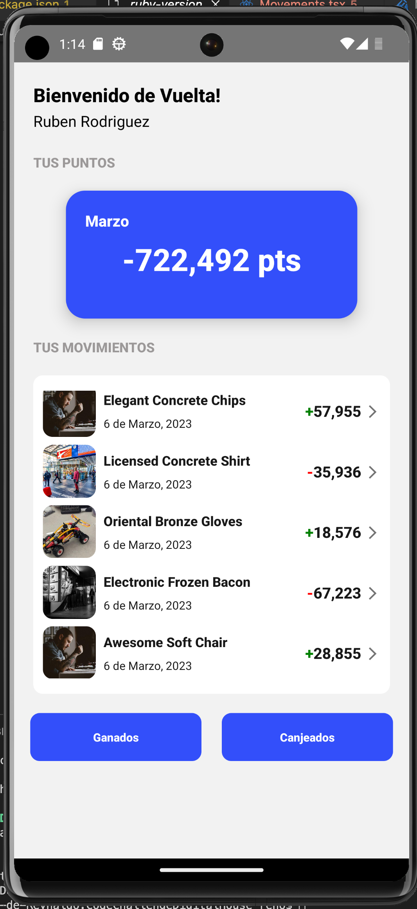
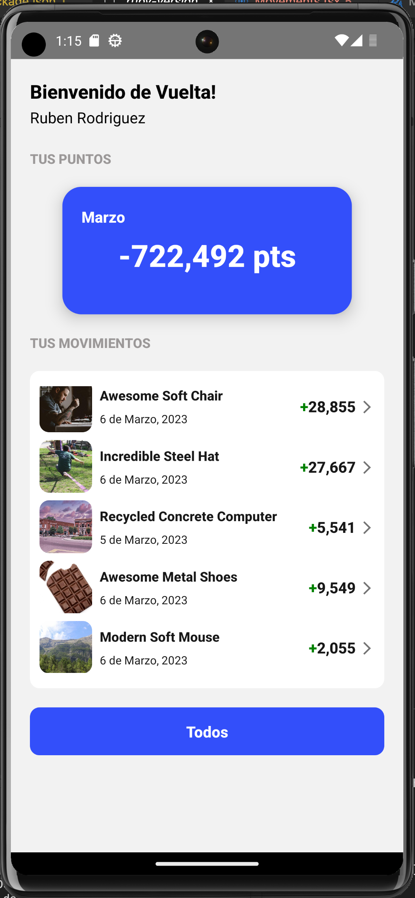
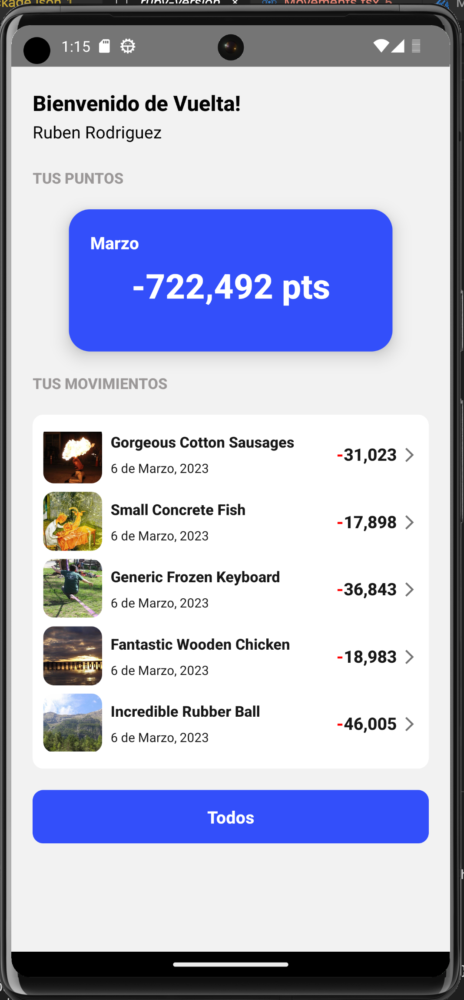

# Coding Challenge Digital House

Simulación de sistema de visualización de movimientos de puntos ganados y canjeados. Se utilizó `React Native` 0.71 con `Typescript`, `Redux Toolkit` para gestión de states y `React Navigation` para navegar pantallas. Para la UI y estilos se utilizó `Native Base` y `Emotion/Native`.

## Requisitos
- react-native mediante `npx`
- Node >= v16 
- Yarn >= v1.22

## Instalación
1. clonar el proyecto
2. ejecutar `yarn` para instalar las dependencias
3. ejecutar `pod install` en la carpeta `ios` (solo para xcode)

## Ejecutar en simulador
- __iOS__
        
         yarn ios

- __Android__

        yarn android
             
## Extras
- __Filtro por fecha:__
    Se incluye configuración de parámetros de fecha para filtrar movimientos (mes y año). Para esto se deben configurar los parámetros en `src/constants/config`.
- __Test unitarios:__
    Se incluyen test unitarios con `Jest` de containers, API, Redux y Utilities. Ejecutar con el comando `yarn test`.

## Capturas de ejemplo

